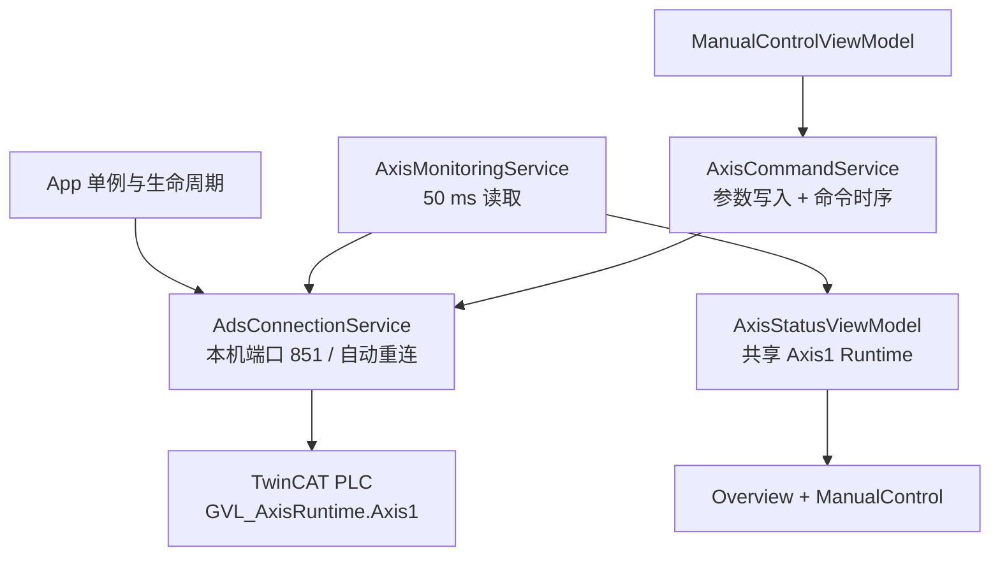

# ZNQInterface — Axis1 ADS 接入与代码位置说明

## 1. 本次实现边界

- 仅接入 PLC `GVL_AxisRuntime.Axis1`。
- Axis1 映射到 WPF `AxisId.DamperX`，即“阻尼器上下料 X 轴”。
- WPF 与 TwinCAT PLC Runtime 运行在同一台倍福工控机，使用本机 AMS Net ID、PLC Runtime 1 端口 `851`。
- 当前可用命令：轴使能、故障复位、停止、绝对定位、相对定位、正/负点动。
- 本次明确禁用：回零、扭矩设置、零位设置。
- 其余 13 根轴不配置 ADS 前缀，界面显示“未接入”，调试控件自动禁用。
- PLC 程序未修改；本次改动全部位于 `ZNQInterface`。

## 2. 运行架构



设计要点：`AdsClient` 只由一个连接服务持有；监控和命令都通过同一个串行 I/O 入口，避免多个页面各自创建连接或并发操作句柄。界面不知道 PLC 字符串符号名，只依赖命令接口和共享轴对象。手动断开前以及自动重连成功后都会清除点动和脉冲位，降低未启用 PLC 看门狗阶段的粘位风险。

## 3. 新增程序及放置位置

| 文件 | 增加位置 | 作用 |
|---|---|---|
| `Communication/Ads/AdsConnectionOptions.cs` | 新建 | 端口 851、50 ms 轮询、1 s 重连、100 ms 命令脉冲配置。 |
| `Communication/Ads/AdsConnectionState.cs` | 新建 | ADS 连接状态枚举。 |
| `Communication/Ads/AdsConnectionStateChangedEventArgs.cs` | 新建 | 向主窗口发布连接状态和文本。 |
| `Communication/Ads/IAdsConnectionService.cs` | 新建 | 应用唯一 ADS 读写接口。 |
| `Communication/Ads/AdsConnectionService.cs` | 新建 | `AdsClient` 生命周期、本机连接、句柄缓存、读写串行化和自动重连。 |
| `Communication/Ads/AdsAxisSymbols.cs` | 新建 | 集中拼装 `.Cmd/.Set/.Data/.State/.Alarm` 叶子符号名。 |
| `Communication/Ads/PlcAxisSnapshot.cs` | 新建 | 保存一次 Axis1 完整轮询结果。 |
| `Communication/Ads/AxisMonitoringService.cs` | 新建 | 后台读取 Axis1，再在 UI 线程一次性更新共享 `Runtime`。 |
| `Services/Axes/IAxisCommandService.cs` | 新建 | 手动运动命令接口。 |
| `Services/Axes/AxisCommandService.cs` | 新建 | 写入定位/点动速度与目标值，执行使能、复位、停止、定位和点动时序。 |
| `Models/Axes/ManualMotionMode.cs` | 新建 | 绝对、相对、点动三种界面模式。 |

## 4. 修改程序及准确插入点

| 文件 | 修改位置 | 具体内容 |
|---|---|---|
| `ZNQInterface.csproj` | 第一个 `ItemGroup` | 增加 `Beckhoff.TwinCAT.Ads` 7.0.317 NuGet 引用。 |
| `App.xaml.cs` | `RegisterTypes` | 注册 `IAdsConnectionService`、`IAxisCommandService`、`AxisMonitoringService` 三个单例。 |
| `App.xaml.cs` | `OnInitialized` 后 | 增加 `StartAdsAsync`，启动自动连接和 Axis1 轮询。 |
| `App.xaml.cs` | `OnExit` | 退出前释放点动/脉冲信号，停止轮询与连接；不自动改变 `bEnable`。 |
| `Models/Axes/AxisDefinition.cs` | `Units` 属性后 | 增加 `AdsSymbolPrefix`、`AdsLimitSymbolPrefix`、`IsAdsMapped`。 |
| `Models/Axes/AxisMotionState.cs` | 原枚举整体 | 数值改为与 PLC `E_AxisMotionState` 完全一致的 0、10…100。 |
| `Models/Axes/AxisRuntimeData.cs` | 原实时属性区域 | 增加 PLC Data/State/Alarm/软限位对应属性。 |
| `ViewModels/Components/Axes/AxisStatusViewModel.cs` | 构造函数创建 `DamperXAxis` 处 | 仅给该轴配置 `GVL_AxisRuntime.Axis1` 和 `GVL_AxisConfig.Axis1Limit`。 |
| `ViewModels/Components/Axes/AxisStatusViewModel.cs` | 文件末尾 `CreateAxis` | 增加带 ADS 前缀的重载；原创建调用默认保持未映射。 |
| `ViewModels/Components/Axes/AxisCommandParameters.cs` | 原 `Velocity` 属性 | 拆成独立 `PositionVelocity` 与 `JogVelocity`。 |
| `ViewModels/Components/Axes/AxisItemViewModel.cs` | 构造函数和状态转换 | 初始化 `IsMapped`；适配 PLC 状态值；首次读通后从 PLC 初始化两个速度输入且不覆盖后续人工输入。 |
| `ViewModels/Pages/ManualControlViewModel.cs` | 原文件整体 | 注入命令服务，增加绝对/相对/点动/使能/复位/停止命令和错误提示。 |
| `Views/Pages/ManualControlView.xaml` | 根元素命名空间 | 增加 Behaviors 与 `Models.Axes` 命名空间。 |
| `Views/Pages/ManualControlView.xaml` | “当前调试轴”区域 | 整区绑定 `CanControlSelectedAxis`，未映射或通信异常时禁止操作。 |
| `Views/Pages/ManualControlView.xaml` | 运动方式下拉框 | 绑定 `SelectedMotionMode`；不再依赖控件 `SelectedIndex`。 |
| `Views/Pages/ManualControlView.xaml` | 绝对/相对/点动按钮 | 绑定命令；点动在鼠标按下时置位，在抬起、移出或丢失捕获时复位。 |
| `Views/Pages/ManualControlView.xaml` | 原“速度”输入行 | 改为两个独立输入。绝对/相对只显示“定位速度”，点动只显示“点动速度”。 |
| `Views/Pages/ManualControlView.xaml` | 回零、力矩、零位 | 设为 `IsEnabled=False` 并增加禁用原因提示。 |
| `Views/MainWindow.xaml` | 顶部连接 ToggleButton、底部状态栏 | 绑定真实连接命令、连接状态与状态文本。 |
| `ViewModels/MainWindowViewModel.cs` | 构造函数及命令区域 | 注入连接服务，增加手动连接/断开命令和跨线程状态更新。 |
| `Resources/Axes/AxisStatusStyles.xaml` | `AxisCommunicationStatusTemplate` | 未映射显示灰色“未接入”；已映射但未读通显示红色“通信异常”。 |

## 5. Axis1 ADS 符号映射

### 5.1 WPF 写 PLC

| 操作 | PLC 符号 | 类型 | 写入方式 |
|---|---|---:|---|
| 轴使能/掉使能 | `GVL_AxisRuntime.Axis1.Cmd.bEnable` | BOOL | 保持值。 |
| 故障复位 | `GVL_AxisRuntime.Axis1.Cmd.bReset` | BOOL | `FALSE → TRUE → 100 ms → FALSE`。 |
| 停止 | `GVL_AxisRuntime.Axis1.Cmd.bStop` | BOOL | 先释放两个点动位，再发送 100 ms 请求；PLC 内部 `bStopExecute` 锁存到停止完成。 |
| 绝对位置 | `GVL_AxisRuntime.Axis1.Set.Position.fAbsolutePosition` | LREAL | 发绝对命令前写入。 |
| 相对距离 | `GVL_AxisRuntime.Axis1.Set.Position.fRelativeDistance` | LREAL | 发相对命令前写入，方向按钮决定正负。 |
| 定位速度 | `GVL_AxisRuntime.Axis1.Set.Position.fVelocity` | LREAL | 绝对/相对命令前写入。 |
| 绝对定位 | `GVL_AxisRuntime.Axis1.Cmd.bMoveAbs` | BOOL | 100 ms 上升沿脉冲。 |
| 相对定位 | `GVL_AxisRuntime.Axis1.Cmd.bMoveRel` | BOOL | 100 ms 上升沿脉冲。 |
| 点动速度 | `GVL_AxisRuntime.Axis1.Set.Jog.fVelocity` | LREAL | 点动置位前写入。 |
| 正/负点动 | `...Cmd.bJogPos` / `...Cmd.bJogNeg` | BOOL | 按住为 `TRUE`，松开、移出或丢失鼠标捕获时写 `FALSE`。 |

### 5.2 PLC 读回 WPF

轮询读取以下字段：

- `Data`：`fSetPosition`、`fActPosition`、`fTargetPosition`、`fSetVelocity`、`fActVelocity`、`fSetAcceleration`、`fActAcceleration`、`fFollowingError`、`fSetTorque`、`fActTorque`、`fActRpm`。
- `State`：`bReady`、`bPowerStatus`、`bHomed`、`bBusy`、`bActive`、`bDone`、`bCommandAborted`、`bCmdRejected`、`eMotionState` 及四个软限位状态。
- `Alarm`：`bError`、`nErrorID`、`eErrorSource`、`bWarning`、`nWarningID`、`eRejectReason`。
- 初始速度：`Set.Position.fVelocity`、`Set.Jog.fVelocity`。
- 软件限位：`GVL_AxisConfig.Axis1Limit.fSoftwareLimitNeg/Pos`。

PLC `LREAL` 对应 C# `double`，`UDINT` 对应 `uint`，PLC 枚举默认 `INT` 对应 ADS 读取的 C# `short`。

## 6. 两个速度输入框的最终行为

采用“基于选择的运动模式切换显示”，而不是同时显示：

| 运动模式 | 显示输入 | PLC 变量 |
|---|---|---|
| 绝对运动 | 定位速度 | `Set.Position.fVelocity` |
| 相对运动 | 定位速度 | `Set.Position.fVelocity` |
| 点动运动 | 点动速度 | `Set.Jog.fVelocity` |

两个值在 `AxisCommandParameters` 中独立保存。轮询首次成功时以 PLC 当前值初始化；之后后台轮询不会覆盖操作员正在编辑的值。点击运动按钮时，界面先将相应速度写到 PLC，再触发命令。

## 7. 工控机编译与联调步骤

1. 在 TwinCAT 中确认 PLC 工程已激活、Runtime 1 正常运行，Axis1 仍绑定模拟轴。
2. 确认 PLC 符号可通过 ADS 访问；本机通信通常不需要额外建立远端路由。
3. 在 Windows/Visual Studio 或 .NET 8 SDK 命令行中执行：

   ```powershell
   dotnet restore .\ZNQInterface.csproj
   dotnet build .\ZNQInterface.csproj -c Debug
   ```

4. 运行 WPF。底部应先显示“正在连接”，随后显示“已连接（端口851）”；Axis1 卡片显示“通信正常”。
5. 在 PLC 在线监控中核对 `GVL_AxisRuntime.Axis1.Data.fActPosition` 与 WPF 实际位置同步。
6. 先测试使能与低速点动，再测试相对和绝对定位。点动必须验证按下置位、松开复位。
7. 验证顶部“断开连接”后调试区变灰，再次“开始连接”后自动恢复。

## 8. 后续扩展建议

当前只有一根轴，使用“叶子符号 + 句柄缓存”最便于首轮定位问题。扩展到 14 根轴时，更推荐在 PLC 增加稳定的 HMI 专用 DTO/交换区，并用 ADS Sum Read/Sum Write 批量交换；瞬时 `bDone/bCmdRejected` 若要保证不丢失，建议改成 PLC 锁存结果加命令序号/应答序号，而不是依赖 50 ms 轮询捕获单周期脉冲。这样比在 WPF 直接按 PLC STRUCT 内存布局整体封送更易版本化，也能避免对齐和类型变化风险。

## 9. 当前验证结果

- 已逐项对照 PLC DUT/GVL，确认本次使用的命令、设置、数据、状态、报警和限位符号名称。
- 已检查所有 XAML 文件均为合法 XML。
- 已检查旧的单一 `Velocity` 绑定和未绑定的运动按钮均已移除/替换。
- 当前执行环境未安装 .NET SDK，无法在此处完成 WPF 编译；交付前已做 C# 分隔符/注释/字符串静态完整性检查。请在目标 Windows/倍福工控机上按第 7 节执行 `restore` 与 `build`。
