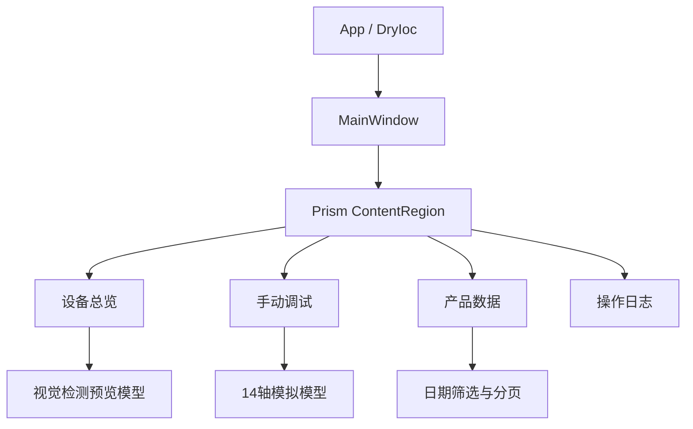

# ZNQInterface 项目架构与 API 实现状态说明

> 审查对象：`ZNQInterface(20260822-091852).zip`  
> 技术栈：.NET 8 / WPF / Prism 8.1.97 / DryIoc / MVVM  
> 审查方式：源码静态分析。WPF 的无效 Binding 通常不会导致编译失败，因此本文将“界面存在”和“功能已连通”严格区分。

## 1. 总体结论

当前项目已经形成可继续扩展的 WPF 上位机界面骨架，完成了 Prism 页面导航、主窗口框架、公共样式、自定义控件、14 轴分组与选中联动、产品模拟数据展示、日期筛选组件和产品分页组件。

但项目目前仍属于“界面原型 + 局部 ViewModel 模拟逻辑”阶段。尚未发现 ADS 通信服务、PLC 变量映射、数据库仓储、相机采集、设备控制命令、实际日志模型或报警处理链路。大量按钮仅能改变自身视觉状态，尚未向 ViewModel、服务层或 PLC 发出动作。

| 状态 | 定义 |
|---|---|
| 已实现 | View、ViewModel/模型及命令或方法已连通，可以产生实际界面行为 |
| 部分实现 | 有可运行的局部逻辑，但数据来自模拟值，或只实现了部分数据链路 |
| 仅界面 | XAML 已完成，但绑定属性、命令、模型或数据源不存在 |
| 未实现 | 项目中没有对应页面、服务或业务逻辑 |

## 2. 当前目录架构

```text
ZNQInterface
├─ App.xaml / App.xaml.cs                 应用启动、容器和导航注册
├─ Infrastructure                         导航键与区域名称
├─ Models                                 设备、导航和产品数据模型
├─ Controls                               公共自定义控件
├─ Resources                              按钮、面板、表格、分页样式
├─ ViewModels
│  ├─ Components                          可复用子 ViewModel
│  ├─ Pages                               页面 ViewModel
│  └─ MainWindowViewModel.cs              主窗口状态和导航
└─ Views
   ├─ MainWindow.xaml                     主框架
   └─ Pages                               设备总览、手动调试、产品数据、操作日志
```



当前没有独立的 `Services`、`Data`、`Repositories` 或 ADS 通信目录，因此 ViewModel 还没有可注入的真实设备/数据服务。

## 3. 应用层与主窗口

### 3.1 已实现

- `App.CreateShell()` 通过 DryIoc 解析 `MainWindow`。
- 注册了以下 Prism 导航映射：
  - `OverviewView` / `OverviewViewModel`
  - `ManualControlView` / `ManualControlViewModel`
  - `ProductDataView` / `ProductDataViewModel`
  - `OperationLogView` / `OperationLogViewModel`
- 程序加载后默认导航到设备总览。
- 主窗口下拉框可切换四个页面。
- 主窗口无原生边框、最大化显示且禁止缩放。
- 系统时间由 `DispatcherTimer` 每秒刷新。
- “软件退出”命令已绑定，带二次确认并在退出前停止计时器。
- 全局资源字典已经正确合并：
  - `PanelStyles.xaml`
  - `ButtonStyles.xaml`
  - `DataGridStyles.xaml`
  - `PaginationStyles.xaml`

### 3.2 仅界面、尚未注入

- “开始连接”切换按钮没有 `IsChecked` Binding，也没有 Command。
- “启动设备”切换按钮没有 `IsChecked` Binding，也没有 Command。
- “故障复位”按钮没有 Command。
- 底部“设备运行状态”“当前报警”“ADS通信”“运行模式”全部是硬编码字符串。
- `DeviceState` 和 `DeviceStatus` 模型已建立，但没有被主窗口或任何服务使用。

### 3.3 风险

当前两个 ToggleButton 点击后会改变文字和颜色，但只改变 WPF 控件自身状态，不代表 ADS 已连接或设备已经启动。这种“视觉成功、业务未执行”的状态在设备软件中容易造成误判，接入真实控制前应绑定到 ViewModel 的真实状态和命令。

## 4. 公共控件与资源

### 4.1 `DataDisplayControl`

已实现为 WPF `UserControl`，通过依赖属性复用轴数据显示布局。

| 属性 | 类型 | 用途 |
|---|---|---|
| `Description` | `string` | 数据名称 |
| `DisplayValue` | `string` | 显示值 |
| `Unit` | `string` | 单位 |
| `AxisStatus` | `string` | 轴状态 |

状态：**控件本身已实现**。但设备总览中的大部分调用传入的是静态字符串，不是实时 Binding。

### 4.2 `ParameterInputControl`

已实现“说明 + 范围 + 输入框 + 单位 + 按钮”的公共输入控件。

| 属性 | 类型 | 用途 |
|---|---|---|
| `Description` | `string` | 参数名称 |
| `RangeText` | `string` | 可填写范围提示 |
| `InputText` | `string` | 双向绑定输入值 |
| `Unit` | `string` | 单位 |
| `ButtonText` | `string` | 按钮名称 |
| `ButtonCommand` | `ICommand` | 执行命令 |
| `ButtonCommandParameter` | `object` | 命令参数 |
| `IsActionEnabled` | `bool` | 按钮可用状态 |

状态：**控件 API 已实现**。当前手动调试页面只绑定了输入值、单位和按钮文字，没有传入 `ButtonCommand`，所以按钮可点击但不会执行任何动作。

### 4.3 公共样式

- 普通按钮和状态按钮样式已统一。
- `TitledPanelStyle` 已使用 `ContentPresenter`，同时支持普通字符串标题和复杂标题布局。
- DataGrid 表头、居中文字、消息文字样式已统一。
- 分页按钮的默认、悬停和禁用外观已统一。

状态：**已实现并在产品数据、操作日志界面调用**。

## 5. 设备总览页面

### 5.1 已实现或部分实现

- 三列总览布局已经完成。
- `ScrewAngleMonitorViewModel` 已提供：
  - `Image`
  - `CurrentAngle`
  - `UpdateResult(ImageSource, double)`
  - `Clear()`
  - `CreatePreview()`
- `CoaxialityMonitorViewModel` 已提供：
  - `Image`
  - `XDeviation`
  - `YDeviation`
  - `Coaxiality`
  - `IsQualified`
  - `UpdateResult(...)`
  - `Clear()`
  - `CreatePreview()`
- `OverviewViewModel` 已创建两套预览模型，因此角度 `47.68°`、X/Y 偏差、同轴度和合格状态可显示模拟结果。
- 同轴度合格/不合格文字颜色触发器已完成。

### 5.2 仅界面或绑定错误

| 界面区域 | 当前状态 |
|---|---|
| 料位状态 | 仅显示“主要内容”占位文字 |
| 不合格料位 | 仅占位 |
| 缓冲料位 | 仅占位 |
| 料仓状态 | 仅占位 |
| 阻尼器上下料轴 | 数值与状态全部硬编码 |
| 料盘上下料轴 | 数值与状态全部硬编码 |
| 夹紧轴、转台轴、螺丝刀轴、调整轴 | 数值、产品编号和状态硬编码 |
| 上下料流程 | Binding 到不存在的 `LoadingProcessText` |
| 同轴度调整流程 | Binding 到不存在的 `AdjustmentProcessText` |
| 螺钉图像 | 使用了错误路径 `ScrewAngleImage.Image`，应为 `ScrewAngleMonitor.Image` |

### 5.3 尚未实现

- 料盘 24 格状态模型与动态颜色。
- 五层料仓状态模型。
- 实际相机图像采集和刷新。
- 上下料流程、同轴度调整流程的实时文本追加机制。
- 总览轴数据与手动调试轴数据共享同一数据源。
- 备料位、调整位产品编号的动态更新。

## 6. 手动调试页面

### 6.1 已实现

- 已按功能组创建 14 根轴的模拟数据：
  - 阻尼器上下料：5 根
  - 托盘上下料：2 根
  - 转台及夹紧：2 根
  - 同轴度调整：3 根
  - 螺丝刀：2 根
- 五个轴列表可以单选，并同步到统一的 `SelectedAxis`。
- 轴切换后以下标题会同步更新：
  - `SelectedAxisDetailHeader`
  - `SelectedAxisDebugHeader`
- `AxisDebugInputViewModel.InitializeForAxis()` 已实现切换轴时初始化位置、速度、距离、加减速度和转矩输入。
- 列表中的使能、回零、通信、限位和故障颜色触发器已完成。
- 公共参数输入控件已用于位置、速度、距离、加速度、转矩和减速度。

### 6.2 只有模拟数据或不能实时刷新

`AxisItemViewModel` 的 `ActualPosition`、`ActualVelocity`、`ActualAcceleration`、`ActualDeceleration`、`ActualTorque`、轴状态布尔量和单位大多是普通自动属性，没有调用 `SetProperty`。因此后续即使 ADS 轮询改变这些值，界面也不会自动收到属性变化通知。

### 6.3 XAML 绑定到不存在的属性

手动调试详细区使用了以下属性，但 `AxisItemViewModel` 中尚未定义：

- `ActualLoad`
- `LoadUnit`
- `SetLoad`
- `RemainingDistance`
- `FollowingError`
- `EnableStatusText`
- `HomeStatusText`
- `CommunicationStatusText`
- `LimitStatusText`
- `FaultStatusText`
- `FaultCode`
- `FaultMessage`

模型实际已有的是 `ActualTorque` 和 `TorqueUnit`，而详细区仍绑定 `ActualLoad`、`LoadUnit`，命名不一致。

### 6.4 仅界面、没有命令

- 轴使能 ToggleButton 没有 `IsChecked` Binding 和 Command。
- 回零、故障复位、停止按钮没有 Command。
- 绝对运动、设定速度、相对运动、设定加速度、设定力矩、设定减速度没有传入 `ButtonCommand`。
- 第五行被标记为“点动控制”，但 XAML 中没有正向/负向点动按钮。
- 没有输入解析、数值范围校验、轴状态联锁或二次确认。

### 6.5 数据问题

- `RelativeDistanceText` 切轴时被初始化为实际位置，不是合理的默认相对距离。
- 转台轴等旋转轴目前仍使用 `mm`、`mm/s` 等直线轴单位，应按实际配置改为 `°`、`°/s` 等。
- 模拟状态中存在“通信异常、正限位、故障”同时为真的组合，可用于视觉测试，但不能作为实际初始状态。

## 7. 产品数据页面

### 7.1 已实现

- 左右 `3:7` 布局完成。
- 日期范围组件已经绑定：
  - `DateFilter.StartDate`
  - `DateFilter.EndDate`
- `DateRangeFilterViewModel` 已实现：
  - 起止日期状态
  - 日期合法性校验
  - 校验提示文字
  - `Clear()`
  - `SetRecentDays(int)`
  - `Contains(DateTime)`
- `ProductDataItem` 已定义检测时间、产品编号、同轴度、是否合格和显示文字。
- `ProductPaginationViewModel` 已实现内存分页：
  - 每页默认 20 条
  - 首页、上一页、下一页、尾页
  - 指定页跳转
  - 最多显示 5 个数字页码
  - 总数、当前页、总页数通知
  - `SetItems()`、`AddItem()`、`Clear()`
- `ProductDataViewModel` 已加载 3 条模拟产品数据。
- DataGrid 已绑定 `Pagination.PagedProducts`。
- DataGrid 各列已配置本页排序字段。
- 当前总条数、分页按钮和页码显示已连通。

### 7.2 只有界面、尚未绑定

XAML 使用了以下绑定，但 `ProductDataViewModel` 中不存在：

- `ProductSearchText`
- `SearchProductCommand`
- `MinimumCoaxialityText`
- `MaximumCoaxialityText`
- `SelectedQualificationStatus`

因此当前只有日期控件能保存输入；产品编号搜索、同轴度范围和合格状态不会改变表格数据。

### 7.3 功能边界

- 数据只存在内存中，关闭软件后丢失。
- 没有数据库查询、保存、更新或导出。
- DataGrid 原生排序作用于当前页 `PagedProducts`，不会先对全部结果排序再重新分页；切换页后排序不会保持为全局排序。
- `ProductDataItem` 没有唯一数据库 ID、检测批次、X/Y 偏差、检测过程状态等扩展字段。

## 8. 操作日志页面

### 8.1 界面已经完成

- 左右 `3:7` 布局。
- 左侧日志文本、日期范围和日志类型筛选界面。
- 类型选项：全部、正常、报警、故障。
- 右侧日期时间、日志类型、日志信息三列表格。
- 首页、上一页、数字页码、下一页、尾页分页界面。
- 公共 DataGrid 和分页按钮样式已调用。

### 8.2 ViewModel 与界面完全不匹配

当前 `OperationLogViewModel` 仍然使用 `ProductDataItem`，只包含：

- `FilteredProducts`
- `SelectedProduct`

但 XAML 需要：

- `LogSearchText`
- `SearchLogCommand`
- `DateFilter`
- `SelectedLogType`
- `Pagination`
- `Pagination.PagedLogs`
- 日志项的 `LogTime`
- `LogType`
- `LogTypeText`
- `LogMessage`

因此操作日志当前应判定为：**界面已完成，数据模型、筛选、分页和命令尚未实现**。运行时会产生多项 Binding 找不到属性的提示，表格不会显示真实日志。

### 8.3 尚未实现

- `OperationLogItem` 或等价日志模型。
- 日志分页 ViewModel。
- 正常/报警/故障类型枚举。
- 日志写入服务。
- 用户操作、设备动作、通信异常和故障事件的统一记录入口。
- 文件或数据库持久化。
- 启动时加载历史日志及会话边界。

## 9. 模型与组件 API 参考

### 9.1 `DateRangeFilterViewModel`

```csharp
DateTime? StartDate { get; set; }
DateTime? EndDate { get; set; }
bool IsRangeValid { get; }
string ValidationMessage { get; }
bool HasDateFilter { get; }
void Clear()
void SetRecentDays(int days)
bool Contains(DateTime dateTime)
```

### 9.2 `ProductPaginationViewModel`

```csharp
ProductPaginationViewModel(int pageSize = 20)
ObservableCollection<ProductDataItem> PagedProducts { get; }
int TotalItemCount { get; }
int CurrentPage { get; }
int PageSize { get; set; }
int TotalPages { get; }
bool CanGoPrevious { get; }
bool CanGoNext { get; }
ObservableCollection<PageNumberItemViewModel> PageNumbers { get; }
DelegateCommand FirstPageCommand { get; }
DelegateCommand PreviousPageCommand { get; }
DelegateCommand NextPageCommand { get; }
DelegateCommand LastPageCommand { get; }
DelegateCommand<int?> GoToPageCommand { get; }
void SetItems(IEnumerable<ProductDataItem> products)
void AddItem(ProductDataItem product)
void Clear()
void GoToPage(int page)
```

### 9.3 `AxisDebugInputViewModel`

```csharp
string AbsolutePositionText { get; set; }
string VelocityText { get; set; }
string RelativeDistanceText { get; set; }
string AccelerationText { get; set; }
string DecelerationText { get; set; }
string TorqueText { get; set; }
void InitializeForAxis(AxisItemViewModel axis)
```

### 9.4 `ScrewAngleMonitorViewModel`

```csharp
ImageSource Image { get; set; }
double? CurrentAngle { get; set; }
void UpdateResult(ImageSource image, double angle)
void Clear()
static ScrewAngleMonitorViewModel CreatePreview()
```

### 9.5 `CoaxialityMonitorViewModel`

```csharp
ImageSource Image { get; set; }
double? XDeviation { get; set; }
double? YDeviation { get; set; }
double? Coaxiality { get; set; }
bool? IsQualified { get; set; }
void UpdateResult(ImageSource image, double xDeviation,
                  double yDeviation, double coaxiality,
                  bool? isQualified)
void Clear()
static CoaxialityMonitorViewModel CreatePreview()
```

## 10. 功能状态总表

| 功能 | 状态 | 说明 |
|---|---|---|
| Prism 页面导航 | 已实现 | 四个页面可切换，默认打开总览 |
| 系统时间 | 已实现 | 每秒刷新 |
| 软件退出 | 已实现 | 有确认弹窗 |
| 公共按钮/面板/表格/分页样式 | 已实现 | 已全局加载 |
| 公共数据显示控件 | 已实现 | 当前多为静态值 |
| 公共参数输入控件 | 已实现 | 页面未传入动作命令 |
| 14 轴分组和选择联动 | 已实现 | 数据为模拟值 |
| 轴状态实时刷新 | 未实现 | 属性通知和 ADS 数据源缺失 |
| 手动轴控制 | 仅界面 | 所有控制命令缺失 |
| 同轴度/角度监控模型 | 部分实现 | 有预览与更新 API，无相机输入 |
| 料位/料仓/流程显示 | 仅界面 | 多为占位或硬编码 |
| 产品模型与模拟数据显示 | 已实现 | 3 条内存数据 |
| 产品日期筛选组件 | 已实现 | 尚未接入统一搜索命令 |
| 产品分页 | 已实现 | 内存分页，默认 20 条/页 |
| 产品编号/同轴度/合格筛选 | 仅界面 | ViewModel 属性和命令缺失 |
| 产品持久化 | 未实现 | 无数据库或仓储层 |
| 操作日志布局 | 已实现 | ViewModel 完全未对接 |
| 日志记录与查询 | 未实现 | 无日志模型、服务和持久化 |
| ADS 通信 | 未实现 | 项目中无 ADS 包、服务或变量映射 |
| PLC 心跳/看门狗 | 未实现 | 无通信层 |
| 相机采集 | 未实现 | 只有 `ImageSource` 接口和预览数据 |
| 报警页面 | 未实现 | 当前项目没有 AlarmView |
| 轴总览页面 | 未实现 | 当前项目没有 AxisMonitorView |
| 参数设置页面 | 未实现 | 当前项目没有 ParameterSettingsView |

## 11. 推荐的下一阶段架构

建议不要继续直接在页面 ViewModel 中堆叠 ADS、数据库和日志代码，而是补充以下接口层：

```text
Services
├─ Communication
│  ├─ IAdsConnectionService
│  ├─ IAxisService
│  └─ IDeviceControlService
├─ Product
│  ├─ IProductRecordRepository
│  └─ IProductQueryService
├─ Logging
│  ├─ IOperationLogService
│  └─ IOperationLogRepository
├─ Alarm
│  └─ IAlarmService
└─ Vision
   ├─ ICoaxialityVisionService
   └─ IScrewAngleVisionService
```

推荐的数据流：


## 12. 建议实施优先级

1. **先修复现有 Binding 缺口**：Overview 图像路径、手动轴详细属性、产品筛选属性、操作日志全部绑定。
2. **把设备按钮绑定到命令和真实状态**：避免 ToggleButton 只改变颜色却没有控制设备。
3. **让轴实时属性支持通知**：所有 ADS 会更新的属性使用 `SetProperty`。
4. **建立 ADS 服务接口并先接一根轴**：连接、心跳、读状态、写命令、超时与异常处理。
5. **建立产品和日志持久化层**：先确定 SQLite 表结构，再接搜索、筛选和分页。
6. **建立统一日志入口**：用户操作、PLC动作、通信异常、报警、故障都通过同一服务记录。
7. **最后接相机和自动流程**：将视觉模块的 `UpdateResult()` 接到真实采集/算法结果。

## 13. 当前完成度判断

若只评价界面布局与 MVVM 框架，当前完成度较高，公共控件和页面分区已经比较清晰。若评价一台可实际联机运行的自动同轴度设备上位机，当前完成的是前端原型和少量内存逻辑，核心设备功能尚未接入。

可概括为：

- **框架层：已基本完成**；
- **界面层：主要页面已形成，部分页面仍有占位内容**；
- **ViewModel 层：手动轴选择、视觉预览、日期组件、产品分页已实现**；
- **服务层：尚未建立**；
- **设备通信、数据库、日志、报警、相机和自动流程：尚未实现真实闭环**。
