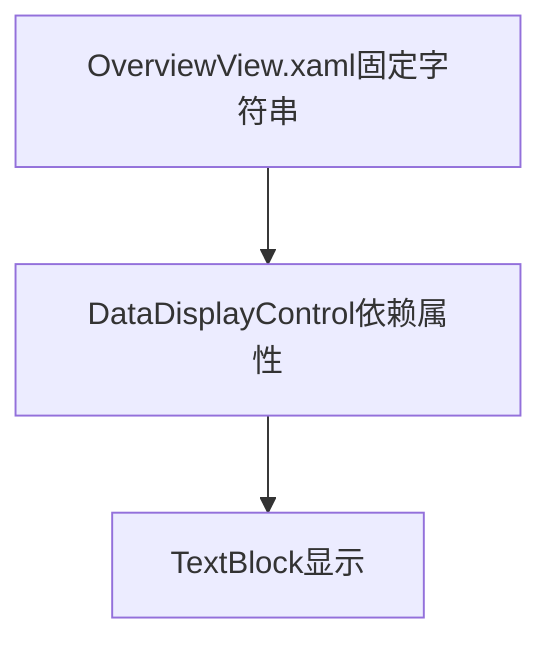
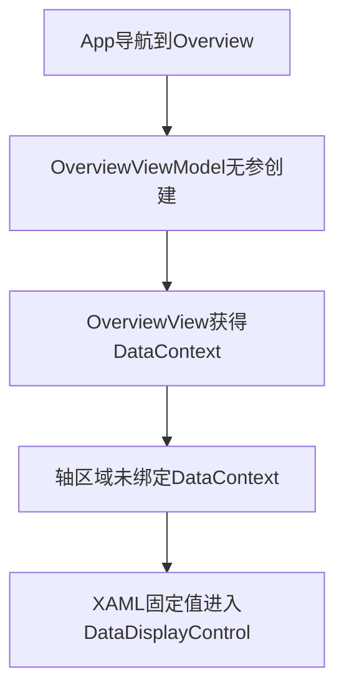
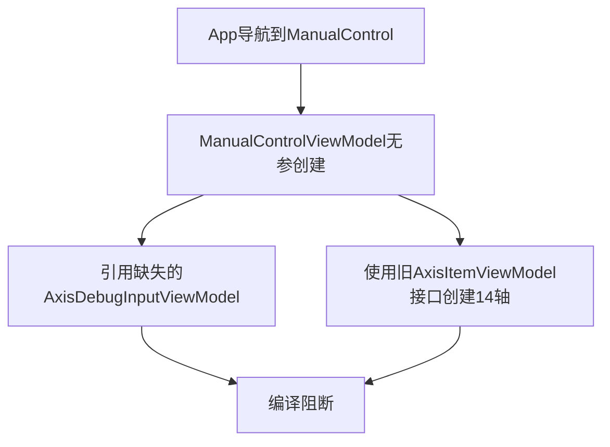
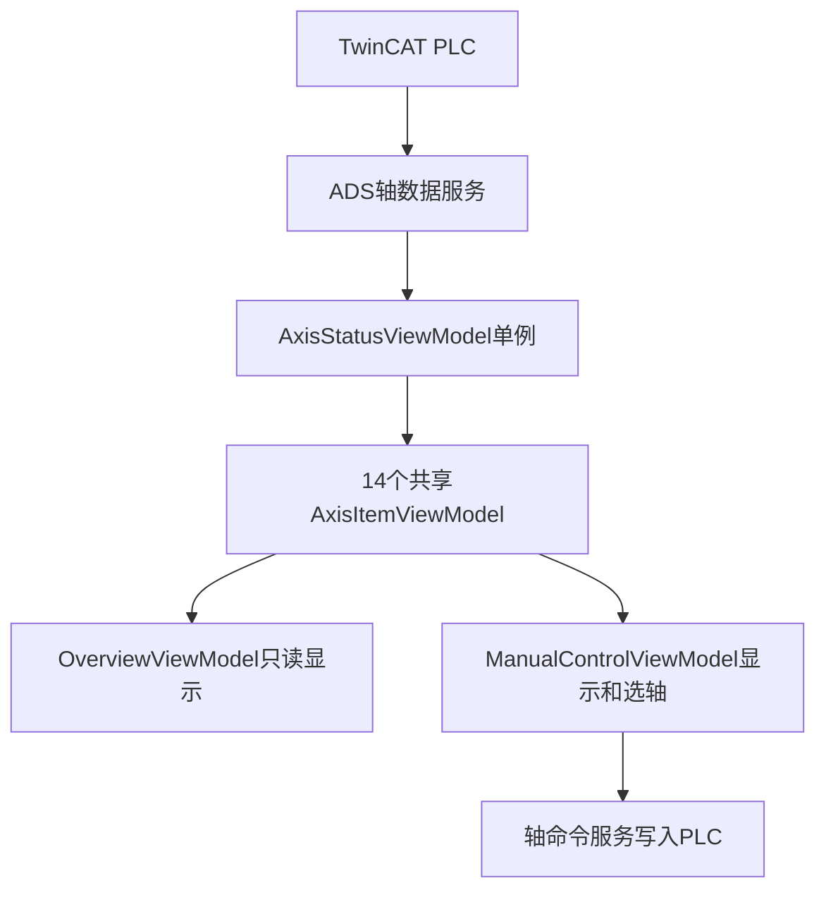

# ZNQInterface 轴管理专项审查报告

> 审查对象：`ZNQInterface(20260826-080158).zip`  
> 审查日期：2026-08-26  
> 审查范围：轴定义、轴号映射、单位、实时数据、命令参数、统一管理、设备总览、手动调试、Prism注册、XAML绑定和预期ADS调用链。

## 1. 总体结论

本次轴管理重构的**设计方向是合理的**：已经开始将轴拆分为固定配置、实时数据、运动状态、单位、单轴ViewModel和统一管理ViewModel，
这比在页面ViewModel中重复创建14根轴更清楚，也适合后续接入TwinCAT ADS。

但是当前项目仍处在“新旧架构同时存在”的中间状态，尚未完成迁移，结论如下：

- 当前源码存在多处**确定的编译阻断问题**，项目按现状不能正常编译。
- 新的 `AxisStatusViewModel` 没有注册、没有注入任何页面，也没有真正进入运行调用链。
- `OverviewViewModel` 没有轴管理属性，设备总览中的轴数值和状态仍全部写死在XAML中。
- `ManualControlViewModel` 仍使用旧版 `AxisItemViewModel` 的无参构造和旧属性，与新版类完全不兼容。
- `ManualControlView.xaml` 仍绑定旧属性路径；即使消除C#编译错误，也会产生大量WPF绑定失败。
- 项目中缺少 `AxisDebugInputViewModel.cs`，但手动调试ViewModel仍然引用它。
- `AxisCommandParameters`、`AxisGroupViewModel`、`AxisDefinition`、`AxisId`、`AxisUnits` 等多个新文件目前没有形成有效调用。
- 当前没有ADS轴数据服务，也没有从PLC数据更新到 `AxisRuntimeData` 的入口，因此实时调用链尚未建立。

综合判断：

| 项目 | 评价 |
|---|---|
| 分层思路 | 合理 |
| 类职责划分 | 基本合理，但尚未落地 |
| 新旧代码一致性 | 不合格 |
| 当前可编译性 | 不通过 |
| 总览页轴数据调用链 | 未建立 |
| 手动调试轴调用链 | 已断裂 |
| 多页面共享同一轴对象 | 未实现 |
| ADS实时更新预留 | 只有数据结构，没有服务入口 |

建议先完成一次“轴模块统一迁移”，不要继续在当前新旧结构上叠加功能。

---

## 2. 审查方法和验证边界

本次完成了以下检查：

- 解压并遍历全部C#、XAML和项目文件。
- 搜索所有轴类、轴属性、构造函数、绑定路径和依赖注入引用。
- 检查设备总览和手动调试页面的轴数据显示路径。
- 检查14根轴的创建位置和对象生命周期。
- 检查XAML是否为合法XML。
- 对新旧 `AxisItemViewModel` 接口进行静态类型对照。

验证结果：

- `App.xaml`、`DataDisplayControl.xaml`、`OverviewView.xaml`、`ManualControlView.xaml` 均通过XML结构解析，未发现标签未闭合等基础XML错误。
- 当前审查环境没有安装 `dotnet`、`msbuild` 或 `csc`，因此无法执行真实构建。
- 尽管没有执行构建，下文列出的构造函数缺失、类型缺失和成员不存在均可由源码直接确定，属于必然编译错误，而不是推测。

---

## 3. 轴管理相关文件清单

### 3.1 固定配置和枚举

| 文件 | 设计职责 | 当前状态 |
|---|---|---|
| `Models/Axes/AxisId.cs` | 定义14根轴的唯一ID | 已定义，未被统一管理类使用 |
| `Models/Axes/AxisType.cs` | 区分直线轴、旋转轴、夹爪轴 | 已定义，仅被 `AxisDefinition` 引用 |
| `Models/Axes/AxisMotionState.cs` | 定义轴运动状态 | 已被实时数据和单轴VM使用 |
| `Models/Axes/AxisUnitSet.cs` | 保存位置、速度、加速度、力矩单位 | 结构合理，当前未进入轴创建流程 |
| `Models/Axes/AxisUnits.cs` | 提供直线轴、旋转轴公共单位 | 已定义，当前未被使用 |
| `Models/Axes/AxisDefinition.cs` | 保存轴号、名称、方向文字、类型和单位 | 结构合理，但没有任何地方创建其实例 |

### 3.2 运行数据和ViewModel

| 文件 | 设计职责 | 当前状态 |
|---|---|---|
| `Models/Axes/AxisRuntimeData.cs` | 保存PLC反馈的实时位置、速度、力矩和状态 | 通知机制正确，但目录和命名空间不一致 |
| `ViewModels/Components/Axes/AxisItemViewModel.cs` | 组合固定定义与实时数据，并生成中文状态文字 | 新版核心类，结构基本合理 |
| `ViewModels/Components/Axes/AxisStatusViewModel.cs` | 创建并统一管理14根轴 | 仍按旧版 `AxisItemViewModel` 写法实现，不能编译 |
| `ViewModels/Components/Axes/AxisCommandParameters.cs` | 保存HMI运动输入参数 | 已定义但完全未调用 |
| `ViewModels/Components/Axes/AxisGroupViewModel.cs` | 预留轴组 | 空类且未调用 |

### 3.3 页面和控件

| 文件 | 设计职责 | 当前状态 |
|---|---|---|
| `ViewModels/Pages/OverviewViewModel.cs` | 设备总览页面状态组合 | 没有轴管理对象 |
| `Views/Pages/OverviewView.xaml` | 显示设备总览轴信息 | 所有轴值和状态仍为固定字符串 |
| `ViewModels/Pages/ManualControlViewModel.cs` | 手动调试选择轴和发送命令 | 仍使用旧轴模型，不能编译 |
| `Views/Pages/ManualControlView.xaml` | 显示轴卡片和调试区域 | 全部绑定旧属性路径 |
| `Controls/DataDisplayControl.xaml/.cs` | 总览页通用四列数据显示控件 | 可以继续使用 |
| `App.xaml.cs` | Prism页面注册和对象生命周期配置 | 未注册共享 `AxisStatusViewModel` |

---

## 4. P0：必须先解决的编译阻断问题

### 4.1 缺少 AxisDebugInputViewModel

`ManualControlViewModel.cs` 中存在：

```csharp
public AxisDebugInputViewModel DebugInput { get; }

DebugInput = new AxisDebugInputViewModel();
```

并且还调用：

```csharp
DebugInput.InitializeForAxis(value);
```

但最新项目中不存在 `AxisDebugInputViewModel.cs`，也没有其他同名类型定义。因此至少会产生：

```text
CS0246: 找不到类型或命名空间名“AxisDebugInputViewModel”
```

处理方式只能二选一：

1. 恢复原来的 `AxisDebugInputViewModel.cs` 并将其改造成适配新版轴模型；
2. 删除该类型，统一使用已经建立的 `AxisCommandParameters`。

推荐第二种，避免保留两个功能重复的输入参数类。

### 4.2 AxisItemViewModel 已取消无参构造，但仍被无参创建

新版 `AxisItemViewModel` 只有以下构造函数：

```csharp
public AxisItemViewModel(AxisDefinition definition)
```

但是当前项目仍有16处类似代码：

```csharp
new AxisItemViewModel
{
    // 旧属性初始化
}
```

其中：

- `ManualControlViewModel` 中14处；
- `AxisStatusViewModel` 两个工厂方法中2处。

这些位置都会产生缺少构造函数参数的编译错误。

### 4.3 ManualControlViewModel 使用了大量已经删除的属性

新版 `AxisItemViewModel` 目前只直接公开：

```csharp
Definition
Runtime
MotionStatusText
```

但 `ManualControlViewModel` 仍直接初始化或读取旧属性，例如：

```csharp
GroupName
DisplayName
ActualPosition
ActualVelocity
SetPosition
SetVelocity
PositionUnit
VelocityUnit
TorqueUnit
MotionStatus
IsEnabled
IsHomed
IsCommunicationOk
PositiveLimit
NegativeLimit
HasFault
RelativeButton1Text
RelativeButton1Factor
RelativeButton2Text
RelativeButton2Factor
```

这些成员在新版 `AxisItemViewModel` 中均不存在。实时数据已移动到 `Runtime`，固定名称和单位已移动到 `Definition`，命令参数应该进入 `AxisCommandParameters`。

### 4.4 AxisStatusViewModel 自身也与新版 AxisItemViewModel 不兼容

`AxisStatusViewModel.FindAxis()` 当前写法为：

```csharp
return AllAxes.FirstOrDefault(
    axis => axis.AxisKey == axisKey);
```

但是新版 `AxisItemViewModel` 没有 `AxisKey` 属性。它应通过以下路径识别轴：

```csharp
axis.Definition.AxisId
```

两个创建方法也仍然初始化已经删除的 `AxisKey`、`GroupName`、`DisplayName`、`PositionUnit` 等属性。

正确方向是先创建 `AxisDefinition`，再传给构造函数：

```csharp
return new AxisItemViewModel(
    new AxisDefinition
    {
        AxisId = AxisId.DamperX,
        PlcAxisNumber = 1,
        GroupName = "阻尼器上下料",
        DisplayName = "X轴（前后）",
        AxisType = AxisType.Linear,
        PositiveDirectionText = "前移",
        NegativeDirectionText = "后移",
        Units = AxisUnits.Linear
    });
```

---

## 5. P1：调用链断裂问题

### 5.1 AxisStatusViewModel 没有进入依赖注入容器

`App.xaml.cs` 当前只注册了页面导航：

```csharp
containerRegistry.RegisterForNavigation
    <OverviewView, OverviewViewModel>(NavigationKeys.Overview);

containerRegistry.RegisterForNavigation
    <ManualControlView, ManualControlViewModel>(NavigationKeys.ManualControl);
```

没有：

```csharp
containerRegistry.RegisterSingleton<AxisStatusViewModel>();
```

因此即使 `AxisStatusViewModel` 内部修复完成，也不会自动成为设备总览和手动调试的共享数据源。

### 5.2 OverviewViewModel 没有轴管理属性

`OverviewViewModel` 当前只有料位、料仓、检测和流程文本模块，没有：

```csharp
public AxisStatusViewModel AxisStatus { get; }
```

构造函数也没有接收统一轴管理实例。

因此设备总览页面不可能从新轴模块获得实时数据。

### 5.3 OverviewView.xaml 仍然全部使用固定值

设备总览的轴区域仍采用：

```xml
DisplayValue="+125.36"
Unit="mm"
AxisStatus="前移"
```

当前共发现16个包含状态的轴数据行，另有一行补偿位移。没有任何一处绑定 `AxisStatusViewModel`、`AxisItemViewModel` 或 `AxisRuntimeData`。

所以目前总览页调用链实际为：



PLC、ADS和ViewModel都没有参与。

### 5.4 ManualControlViewModel 仍然自己创建14根轴

手动调试页面仍然建立：

```csharp
DamperLoadingAxes
TrayLoadingAxes
TurntableAxes
AdjustmentAxes
ScrewdriverAxes
```

并在构造函数中重复创建14个轴对象。

这与“统一管理14根轴”的目标相冲突。即使把旧属性重新加回来使其能够编译，设备总览和手动调试依然会是两套对象，状态不会同步。

### 5.5 ManualControlView.xaml 仍然绑定旧路径

轴卡片中仍然使用：

```xml
{Binding DisplayName}
{Binding MotionStatus}
{Binding ActualPosition}
{Binding PositionUnit}
{Binding ActualVelocity}
{Binding IsEnabled}
```

新版对象对应路径应分别是：

```xml
{Binding Definition.DisplayName}
{Binding MotionStatusText}
{Binding Runtime.ActualPosition}
{Binding Definition.Units.Position}
{Binding Runtime.ActualVelocity}
{Binding Runtime.IsEnabled}
```

手动调试下方当前轴区域同样需要整体迁移。

---

## 6. 新轴模型架构评价

### 6.1 AxisDefinition

优点：

- 将轴号、名称、类型、单位和正负方向文字集中管理，职责清楚。
- 能解决X/Y/Z/旋转轴方向文字不同的问题。
- 能避免在多个页面重复写轴名称和单位。

需要改进：

- 应通过构造函数或 `required` 属性保证名称、方向和单位不会为 `null`。
- 应确定 `PlcAxisNumber` 与 `AxisId` 是否一一对应，不要在通信层依赖强制类型转换。
- 建议增加轴参数范围，例如最大速度、最大力矩、位置上下限；当前XAML中的输入范围仍全部写死。
- 对夹爪轴应明确使用 `AxisType.Gripper`，不能全部按普通直线轴创建。

### 6.2 AxisUnitSet 和 AxisUnits

整体设计合理，单位属于静态配置，不需要实现属性通知。

当前存在一个单位一致性问题：

```csharp
Position = "°"
Velocity = "r/s"
Acceleration = "r/s²"
```

位置使用角度而速度使用转数，必须确认PLC反馈量：

- 如果PLC返回角度：统一为 `°`、`°/s`、`°/s²`；
- 如果PLC返回转数：统一为 `r`、`r/s`、`r/s²`；
- 如果确实需要混用，必须在ADS数据映射层执行明确换算。

### 6.3 AxisMotionState

使用枚举代替中文状态字符串是正确方向。

但当前注释写的是“最好与PLC枚举保持一致”，这不足以作为通信协议。必须明确选择：

1. C#枚举数值与PLC枚举严格一致；或
2. ADS服务显式将PLC状态转换为C#状态。

推荐第二种，因为PLC运动状态可能包含定位、点动、连续运动、转矩模式、停止中和错误停止等更多状态。不要直接把任意PLC整数强制转换为当前枚举。

另外，方向状态与运动方式是两个维度：绝对运动可以正向也可以负向。后续可按PLC实际结构决定是否拆分为：

- `AxisMotionMode`：绝对、相对、点动、回零、转矩；
- `AxisDirection`：正向、负向、静止；
- `AxisMotionState`：未使能、运动中、停止中、已到位、故障。

在当前功能较少的阶段，也可以先保留现有单枚举，但必须建立明确的PLC映射方法。

### 6.4 AxisRuntimeData

优点：

- 实际位置、速度、力矩和布尔状态全部通过 `SetProperty` 更新，具备实时刷新能力。
- 实时反馈和固定配置已经分离。

需要改进：

- 文件位于 `Models/Axes`，命名空间却是 `ZNQInterface.ViewModels.Components.Axes`，结构不统一。
- 如果它继承 `BindableBase`，建议移动到 `ViewModels/Components/Axes`；如果希望它保持纯Model，则不要继承Prism类型，由 `AxisItemViewModel` 暴露通知属性。
- 建议增加统一 `ApplySnapshot()`，一次接收ADS读取结果，避免通信层逐个散写属性。
- ADS通常在后台线程读取数据，更新WPF绑定属性时应切换到UI线程或由UI定时器消费最新快照。

### 6.5 AxisItemViewModel

组合 `Definition + Runtime` 的设计合理，方向相关中文状态由单轴VM生成也合理。

需要改进：

- 应在构造函数中检查 `definition` 不能为空。
- `MotionStatusText` 当前只监听 `MotionState`，符合现有需求。
- `Runtime` 为本对象独占，因此事件订阅一般不会形成实际泄漏；如果未来允许替换Runtime对象，应解除旧事件订阅。
- 为方便XAML，可以保留嵌套绑定；不建议为了缩短绑定路径重新复制一套可变实时属性。

### 6.6 AxisStatusViewModel

“统一持有14根轴”是正确职责，但当前实现没有使用自己新建的 `AxisDefinition` 体系。

建议：

- 使用 `AxisId` 作为查找键，不再使用字符串 `axisKey`。
- 内部建立 `Dictionary<AxisId, AxisItemViewModel>`。
- `AllAxes` 对外使用 `IReadOnlyList` 或 `ReadOnlyObservableCollection`，防止页面删除轴后破坏命名属性与集合的一致性。
- 分组集合应由同一批 `AllAxes` 对象筛选得到，不能重新创建轴。
- 如果 `AxisGroupViewModel` 不用于XAML分组，直接删除；如果使用，则实现 `GroupName + IReadOnlyList<AxisItemViewModel>`。

严格分层时，跨页面共享的对象更适合命名为 `AxisStateStore`，页面ViewModel再引用它。对于当前14轴小型上位机，保留 `AxisStatusViewModel` 单例也可以接受，前提是它只管理状态，不承载页面专用命令。

### 6.7 AxisCommandParameters

该类本身的参数分类基本合理，但目前完全未被使用。

需要先明确参数属于：

- 每根轴长期保存一份；还是
- 当前选中轴调试区域的临时输入。

如果每根轴保留各自的设置值，可将其作为 `AxisItemViewModel.CommandParameters`。

如果切换轴时按实时值重新初始化输入框，可在 `ManualControlViewModel` 中只保留一个 `CurrentCommandParameters`。

不建议同时恢复 `AxisDebugInputViewModel` 又保留 `AxisCommandParameters`。

### 6.8 AxisGroupViewModel

当前是空类且有多余 `using`，没有任何实际作用。

处理方式：

- 当前不需要动态分组时删除；
- 需要用统一模板生成五个轴组时再完整实现。

不要长期保留空类作为模糊的“以后可能使用”占位。

---

## 7. XAML与交互逻辑问题

### 7.1 DataDisplayControl 可以继续使用

该控件通过依赖属性接收：

- `Description`
- `DisplayValue`
- `Unit`
- `AxisStatus`

内部通过 `RelativeSource` 绑定控件自身，写法正确，不会覆盖页面DataContext。

需要注意 `DisplayValue` 当前类型为 `string`。绑定 `double` 时可以通过 `StringFormat`生成字符串；如果后续需要同时显示数字、空值和不同精度，也可以将依赖属性改为 `object`，但当前并非必须。

### 7.2 设备总览应绑定共享轴对象

示例：

```xml
<controls:DataDisplayControl
    Description="X轴（前后）位置："
    DisplayValue="{Binding AxisStatus.DamperXAxis.Runtime.ActualPosition,
        Mode=OneWay,
        StringFormat={}{0:+0.00;-0.00;0.00}}"
    Unit="{Binding AxisStatus.DamperXAxis.Definition.Units.Position,
        Mode=OneWay}"
    AxisStatus="{Binding AxisStatus.DamperXAxis.MotionStatusText,
        Mode=OneWay}"/>
```

### 7.3 手动调试输入框绑定不完整

当前只有相对距离和转矩文本等少量旧绑定，以下输入框没有形成完整的TwoWay绑定：

- 绝对目标位置；
- 速度；
- 力矩；
- 零位位置。

“写入参数”按钮也没有命令绑定。

### 7.4 轴控制按钮调用链尚未实现

当前：

- 相对运动按钮绑定了 `RelativeMoveCommand`，但方法内部只计算目标距离，没有调用ADS服务；
- 绝对运动按钮没有命令；
- 点动按钮没有按下/松开命令；
- 使能、回零、故障复位、停止按钮没有命令；
- 写入参数按钮没有命令。

因此手动调试目前只有界面和局部占位逻辑，不存在完整控制调用链。

---

## 8. 14轴定义一致性问题

当前新 `AxisId` 定义的14轴为：

| 编号 | 轴ID | 所属机构 |
|---:|---|---|
| 1 | DamperX | 阻尼器上下料 |
| 2 | DamperY | 阻尼器上下料 |
| 3 | DamperZ | 阻尼器上下料 |
| 4 | DamperRotation | 阻尼器上下料 |
| 5 | DamperGripper | 阻尼器上下料 |
| 6 | TrayX | 料盘上下料 |
| 7 | TrayY | 料盘上下料 |
| 8 | Turntable | 转台 |
| 9 | Clamping | 夹紧轴 |
| 10 | AdjustmentX | 同轴度调整 |
| 11 | AdjustmentY | 同轴度调整 |
| 12 | AdjustmentZ | 同轴度调整 |
| 13 | ScrewdriverY | 螺丝刀 |
| 14 | ScrewdriverZ | 螺丝刀 |

但设备总览存在以下差异：

- “料盘上下料”显示X轴和Z轴，新轴表为X轴和Y轴；
- 总览中还有“调整轴夹爪”，新14轴表中没有；
- 总览的“夹爪角度”更像 `DamperRotation`，名称容易误导；
- 总览中的“补偿位移”不是独立物理轴，更适合绑定同轴度算法/检测模块；
- 手动调试使用“托盘上下料”，总览使用“料盘上下料”，名称未统一。

在编写最终 `AxisDefinition` 前，应先冻结一份PLC与HMI共同使用的14轴对照表，包括：

- 上位机 `AxisId`；
- PLC数组索引或轴号；
- TwinCAT轴引用名称；
- 中文名称；
- 所属机构；
- 直线/旋转/夹爪类型；
- 正负方向定义；
- 工程单位；
- 位置、速度、力矩范围。

---

## 9. 当前调用链与目标调用链

### 9.1 当前设备总览调用链



该链路只能显示演示值。

### 9.2 当前手动调试调用链



该链路当前不能成立。

### 9.3 推荐目标调用链



推荐职责：

- ADS数据服务：读取PLC并转换为上位机快照；
- `AxisStatusViewModel`：保存14根轴的当前状态；
- `OverviewViewModel`：只读引用轴状态；
- `ManualControlViewModel`：选择轴、校验输入并调用命令服务；
- XAML：负责显示、颜色和布局，不保存业务状态。

---

## 10. 推荐修改顺序

### 第一步：冻结14轴映射

先解决料盘Y/Z、调整夹爪是否存在、轴号和单位等机械定义问题。否则代码修改后仍会继续返工。

### 第二步：修复 AxisStatusViewModel

- 用 `AxisDefinition` 创建14个 `AxisItemViewModel`；
- 使用 `AxisId` 查找，不使用字符串键；
- 创建只读分组集合；
- 不在页面ViewModel中再次创建轴。

### 第三步：统一输入参数类

- 保留 `AxisCommandParameters`；
- 删除对缺失 `AxisDebugInputViewModel` 的依赖；
- 或恢复后只保留其中一个类。

### 第四步：注册共享实例

在 `App.xaml.cs` 增加：

```csharp
containerRegistry.RegisterSingleton<AxisStatusViewModel>();
```

后续接入ADS时，再注册轴数据服务和轴命令服务。

### 第五步：修改页面构造函数

```csharp
public OverviewViewModel(AxisStatusViewModel axisStatus)
{
    AxisStatus = axisStatus;
}
```

```csharp
public ManualControlViewModel(AxisStatusViewModel axisStatus)
{
    AxisStatus = axisStatus;
    SelectedAxis = axisStatus.AllAxes.FirstOrDefault();
}
```

### 第六步：整体迁移 ManualControlView.xaml 绑定路径

不要逐个遇到绑定错误再临时补旧属性，应一次性将所有旧路径迁移到：

- `Definition.*`
- `Runtime.*`
- `MotionStatusText`
- `CommandParameters.*`

### 第七步：替换 OverviewView.xaml 固定值

将所有轴相关 `DisplayValue`、`Unit` 和 `AxisStatus` 改成共享轴对象绑定。

### 第八步：接入ADS更新入口

建议轴管理器提供：

```csharp
public void ApplyAxisSnapshot(
    AxisId axisId,
    AxisRuntimeSnapshot snapshot)
```

ADS服务只传输和映射数据，不直接操作页面控件。

### 第九步：完成控制命令

按优先级接入：

1. 使能；
2. 停止；
3. 故障复位；
4. 回零；
5. 绝对运动；
6. 相对运动；
7. 点动按下/松开；
8. 参数写入。

### 第十步：编译和运行验证

至少验证：

- 项目无编译错误；
- WPF输出窗口无BindingExpression错误；
- 两个页面引用的是同一根轴对象；
- 修改一根轴的实时位置后，设备总览和手动调试同时刷新；
- 切换轴不会复制或丢失状态；
- 后台ADS刷新不会引发跨线程异常；
- 页面反复导航后不会重复创建14根轴。

---

## 11. 最终判断

当前轴模块不是“架构设计错误”，而是“新架构只完成了类定义，旧页面和旧ViewModel尚未迁移”。

可以保留并继续使用的核心设计包括：

- `AxisId`
- `AxisType`
- `AxisMotionState`
- `AxisUnitSet`
- `AxisUnits`
- `AxisDefinition`
- `AxisRuntimeData`
- `AxisItemViewModel`
- `DataDisplayControl`

需要重写或完成迁移的部分包括：

- `AxisStatusViewModel`
- `ManualControlViewModel`
- `ManualControlView.xaml`全部轴绑定
- `OverviewViewModel`
- `OverviewView.xaml`全部轴固定值
- `App.xaml.cs`共享实例注册

需要删除、恢复或明确用途的部分包括：

- 缺失的 `AxisDebugInputViewModel`
- 未使用的 `AxisCommandParameters`
- 空的 `AxisGroupViewModel`

完成上述迁移后，整体架构可以达到职责清楚、14轴统一管理、总览与手动调试同步，并具备接入TwinCAT ADS的条件。
